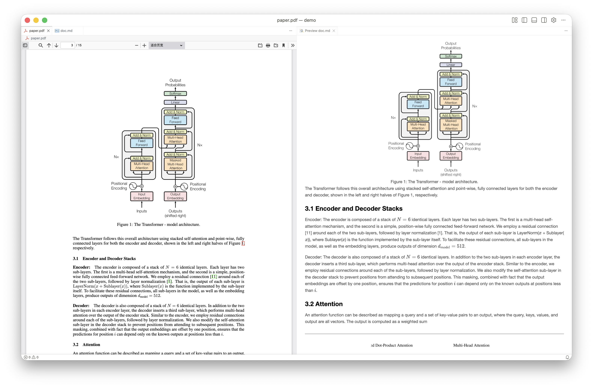

# PDF to Markdown Converter

<p align="center">
  <a href="https://github.com/Peng-YM/pdf-to-markdown/stargazers">
    
  </a>
  <a href="https://github.com/Peng-YM/pdf-to-markdown/network/members">
    
  </a>
  <a href="https://github.com/Peng-YM/pdf-to-markdown/issues">
    
  </a>
  <a href="https://github.com/Peng-YM/pdf-to-markdown/blob/master/LICENSE">
    
  </a>
  <a href="https://github.com/Peng-YM/pdf-to-markdown/releases">
    
  </a>
  <a href="https://github.com/Peng-YM/pdf-to-markdown/releases">
    
  </a>
</p>

A command-line tool for converting PDF documents to Markdown with support for multiple document parsing service providers, built with a modular architecture.

<p align="center">
  
</p>

## Features

- Multiple provider support: PaddleOCR, Zhipu AI (lite/expert/prime)
- Complex element parsing: text, images, tables, formulas, and more
- Structured JSON output, meaningful exit codes, and dry-run support
- Easy installation with one-click script for Linux/macOS/Windows
- Flexible configuration with extensive CLI options
- Built-in caching to avoid redundant API calls
- Duplicate detection based on file hash and URL

### Supported Document Elements

- Text: paragraphs, headings, lists, and other text content
- Images: automatic extraction and saving of document images
- Tables: intelligent table recognition and conversion to Markdown format
- Formulas: LaTeX formula recognition with formula numbering
- Layout: automatic document layout structure detection

Optimized for academic publications such as Arxiv papers.

## Installation

### One-Click Install Script

Linux/macOS:

```bash
curl -fsSL https://raw.githubusercontent.com/Peng-YM/pdf-to-markdown/master/install.sh | bash
```

For alternative installation methods, see [GitHub Releases](https://github.com/Peng-YM/pdf-to-markdown/releases) or build from source.

For more development information, see [CONTRIBUTING.md](./CONTRIBUTING.md).

## API Key Configuration

### PaddleOCR
- Application URL: https://aistudio.baidu.com/paddleocr
- Free quota: 20,000 pages per day

### Zhipu AI
- Application URL: https://bigmodel.cn/usercenter/proj-mgmt/apikeys
- Note: Real-name authentication required

## Usage

### Basic Usage

```bash
# Using PaddleOCR with local file
export PADDLE_OCR_API_KEY="your_api_key"
pdf-to-markdown parse document.pdf

# Using Zhipu AI with local file
export ZHIPU_API_KEY="your_api_key"
pdf-to-markdown parse --provider zhipu/lite document.pdf

# Using URL to download PDF directly
pdf-to-markdown parse https://example.com/document.pdf

# Using arxiv abs link (automatically converts to pdf link)
pdf-to-markdown parse https://arxiv.org/abs/2301.07041
```

### Full Options

```bash
pdf-to-markdown parse \
  --provider zhipu/expert \
  --api-key "your_api_key" \
  --pages 1-5,10 \
  --output-dir ./output/ \
  --json \
  document.pdf
```

### Subcommands

#### `metadata` - Extract PDF Metadata

```bash
# Extract metadata in human-readable format with local file
pdf-to-markdown metadata document.pdf

# Extract metadata using URL
pdf-to-markdown metadata https://example.com/document.pdf

# Extract metadata using arxiv abs link (automatically converts to pdf)
pdf-to-markdown metadata https://arxiv.org/abs/2301.07041

# Output in JSON format
pdf-to-markdown metadata document.pdf --json

# Save to file
pdf-to-markdown metadata document.pdf -o metadata.json
```

#### `parse` - Convert PDF to Markdown

```bash
# Basic usage with local file
pdf-to-markdown parse document.pdf

# Using URL to download PDF directly
pdf-to-markdown parse https://example.com/document.pdf

# Using arxiv abs link (automatically converts to pdf link)
pdf-to-markdown parse https://arxiv.org/abs/2301.07041

# Specify output directory
pdf-to-markdown parse document.pdf -o ./output/

# Specify page ranges
pdf-to-markdown parse document.pdf --pages 1-5,10,15-20

# Use different providers
pdf-to-markdown parse --provider paddleocr document.pdf
pdf-to-markdown parse --provider zhipu/lite document.pdf
pdf-to-markdown parse --provider zhipu/expert document.pdf
pdf-to-markdown parse --provider zhipu/prime document.pdf

# Dry run to preview operations
pdf-to-markdown parse document.pdf --dry-run

# JSON output
pdf-to-markdown parse document.pdf --json

# Quiet mode (output only file path)
pdf-to-markdown parse document.pdf --quiet

# Overwrite existing output files
pdf-to-markdown parse document.pdf --overwrite

# Disable cache temporarily
PDF_TO_MARKDOWN_NO_CACHE=1 pdf-to-markdown parse document.pdf
```

#### `cache` - Cache Management

```bash
# View cache status
pdf-to-markdown cache status

# View cache status in JSON format
pdf-to-markdown cache status --json

# Clear cache with confirmation
pdf-to-markdown cache clear

# Force clear cache without confirmation
pdf-to-markdown cache clear --force
```

## Caching

The tool automatically caches parsing results to avoid redundant API calls for the same PDF files or URLs, saving cost and time.

### Cache Mechanism

- File hash: SHA256 hash of local files as cache key
- URL hash: SHA256 hash of URLs as cache key
- Multi-dimensional caching: Cache key includes provider type and page ranges to prevent confusion between different configurations
- Image caching: Extracted images are also cached to speed up repeated parsing

### Cache Location

Cache is stored in system standard cache directories:
- Linux: `~/.cache/pdf-to-markdown/`
- macOS: `~/Library/Caches/pdf-to-markdown/`
- Windows: `%LOCALAPPDATA%\\pdf-to-markdown\\cache\\`

### Disabling Cache Temporarily

In some cases, you may want to bypass the cache and re-parse the file:

```bash
# Method 1: Set environment variable
PDF_TO_MARKDOWN_NO_CACHE=1 pdf-to-markdown parse document.pdf

# Method 2: Use true value
PDF_TO_MARKDOWN_NO_CACHE=true pdf-to-markdown parse document.pdf
```

## Development and Contributing

For more development information, architecture design, and how to extend with new providers, see [CONTRIBUTING.md](./CONTRIBUTING.md).

## Automation-Friendly Design

This tool is optimized for automation and script integration:

- Structured output: `--json` flag for JSON format output
- Meaningful exit codes: 0=success, 1=failure, 2=usage error, 3=not found, 4=permission, 5=conflict
- Dry-run support: `--dry-run` to preview operations
- Quiet mode: `--quiet` suitable for scripts and pipelines
- Actionable errors: Includes error types and repair suggestions
- Comprehensive help: Extensive examples and clear parameter documentation

## License

MIT
